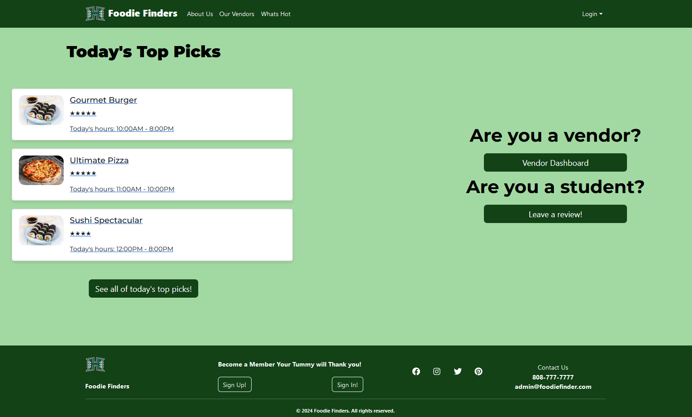
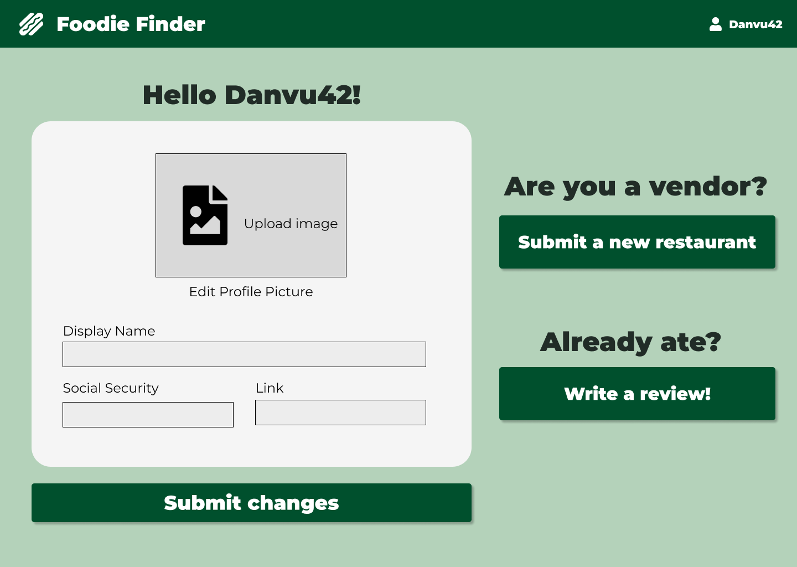
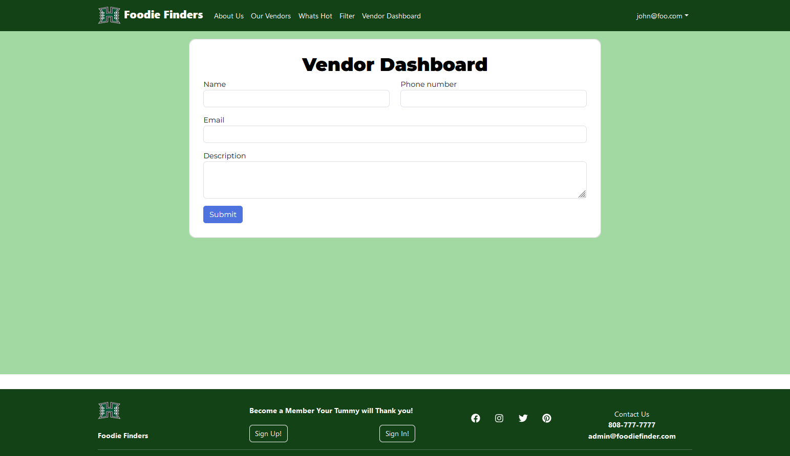

# FoodieFinders

## Table of contents

* [Overview](#overview)
* [Team](#team)
* [Landing page](#landing-page)
* [User profile page](#user-profile-page)
* [Vendor home page](#vendor-home-page)
* [About Us](#about-us)

## Overview

The problem: There are many food choices on campus: campus center, food trucks, Manoa Gardens, Paradise Palms, vending machines, and so forth. Let’s say you have a desire for chinese food today for lunch. What places on campus are serving chinese food menu items today? Alternatively, let’s say that you love the fresh salmon fillet at Campus Center, but that dish is only served once every few weeks. How do you find out on the day that it’s available?

The solution: The Manoa Munchie app enables you to login on your phone and determine:

What specific menu items will be available today at campus center locations;
What food is available right now.
When a style of food you love is available today.

## Team

Manoa Munchies is designed, and implemented by [Ricki Ace Gaborno](https://rickiace.github.io/),[Ezekiel Ira Nunez](https://ezekielira.github.io/), [Dan Vu](https://danvu42.github.io/), [Ibrahim Matar](https://hima700.github.io/) and [Joshuah D. Jones](https://jj17de.github.io/).

## Team Contract
[https://docs.google.com/document/d/1wZS-q4oLNYJF6PaphSvtI7CZfoSVRkpzUpeGCCYLOMM/edit?usp=sharing](https://docs.google.com/document/d/1wZS-q4oLNYJF6PaphSvtI7CZfoSVRkpzUpeGCCYLOMM/edit?usp=sharing)

## Development

The development process will be conforming to the Issue Driven Project Management style of development. The development is consisted of several milstones, each having several tasks meant for each person in the group. 

## Landing Page

Upon launching the application, users are welcomed to the landing interface featuring "Today's Top Picks"—a curated showcase of the day's most esteemed dining
selections based on peer reviews and ratings. Next to this feature there will be a selection portal, where the user can identify themselves as either a vendor or a student. Vendors are redirected to their Vendor Home Page, and students are able to leave reviews on meals they have tried.

## User profile page

Upon arriving at the landing page, users can navigate to the sign-in link or, if already signed in, can select their username. This action redirects them to their profile page, which displays their personal information. On this page, users have the option to edit and update their profile details.For vendor users, the profile page serves as a platform to submit their restaurant details and credentials for verification and for students they have a selection to write a review.

## Vendor home page

Similar to the user profile page this page is exclusively for vendors. It provides a specialized space where vendors can add establishments they are currently operating. The page features an intuitive dashboard displaying reviews of their owned businesses as well as detailed information on each particular location. Additionally, vendors have the ability to make modifications to their business listings, ensuring their information is current and accurately reflects their offerings.

## Milestone 1

The first milestone consists of the development of HTML pages, meant to be a mockup of the Manoa Munchies app. This includes the development of the UI/UX, the general aesthetic considerations, and the beginnings of how users would be using it.

By the end of this milestone, the system would be deployed to Digital ocean. The following image contains the tasks divided out to group members.

    

## About Us

### Dan Vu
My name is Dan Vu, I'm an Electrical Engineering major in my third year at UH Manoa. I have a particular interest in web design and web development, which is the main reason why I took ICS 314 as an engineering breadth elective.

### Ezekiel Ira Nunez
My name is Ezekiel Ira Nunez, I'm a Data Science major at UH Manoa. I wasn't initially interested in web design, but came to appreciate it more and more. I want to eventually get into the video game industry.

### Ricki Ace Gaborno
My name is Ricki Ace Gaborno, I'm a Computer Scientist major in UH Manoa. I was more interested in computer engineering but did computer science instead because I want to eventually start making games or work for a video game company.

### Ibrahim Matar
My name is Ibrahim Matar, I’m a Computer Engineering major in my last semester, i am interested in software development and cybersecurity.

