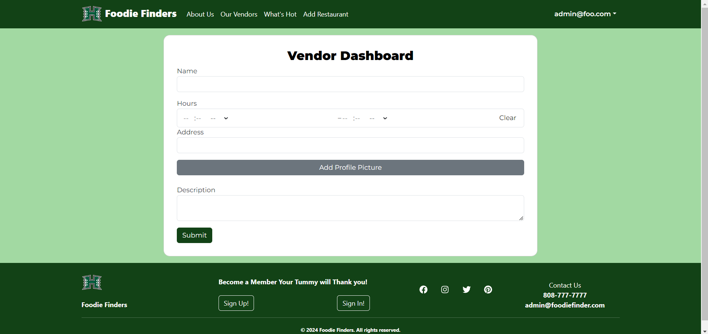
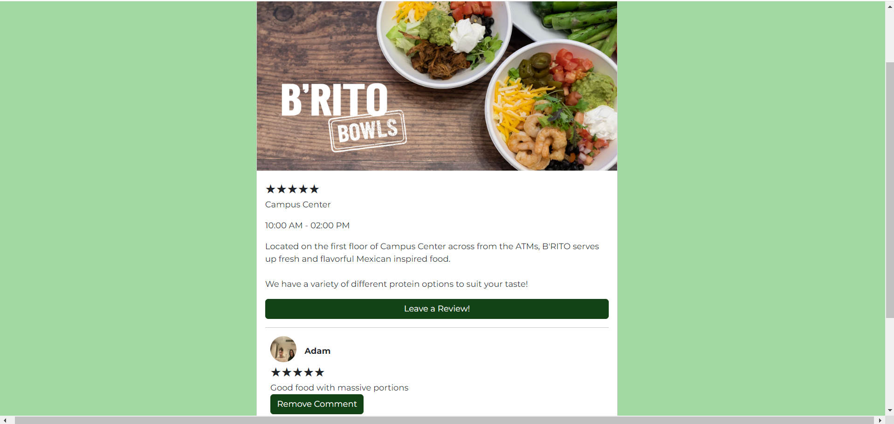
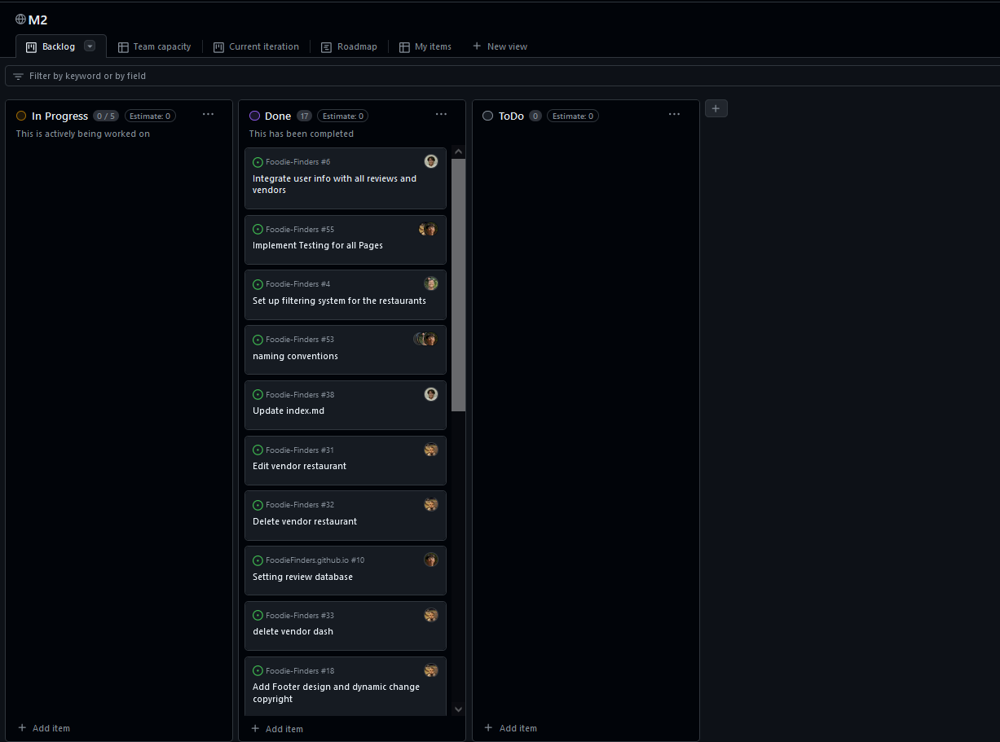
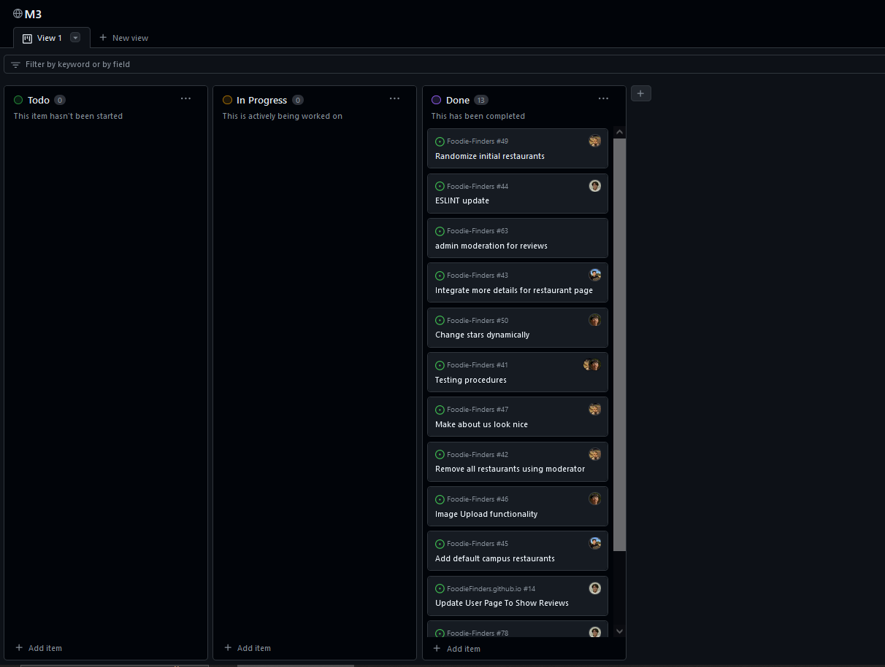

# FoodieFinders

## Table of contents

* [Overview](#overview)
* [Team](#team)
* [Installation](#installation)
* [Landing page](#landing-page)
* [User profile page](#user-profile-page)
* [Edit User Profile Page](#edit-user-profile-page)
* [Add Restaurant Page](#add-restaurant-page)
* [Our Vendors Page](#our-vendors-page)
* [Whats Hot Page](#whats-hot-page)
* [Review Page](#review-page)
* [About Us](#about-us-page)
* [Milestone 1](#milestone-1)
* [Milestone 2](#milestone-2)
* [Milestone 3](#milestone-3)
* [Community Feedback](#community-feedback)
* [Meet Our Developers](#meet-our-developers)


## Overview

The problem: There are many food choices on campus: campus center, food trucks, Manoa Gardens, Paradise Palms, vending machines, and so forth. Let’s say you have a desire for chinese food today for lunch. What places on campus are serving chinese food menu items today? Alternatively, let’s say that you love the fresh salmon fillet at Campus Center, but that dish is only served once every few weeks. How do you find out on the day that it’s available?

The solution: The FoodieFinders app enables you to login on your phone and determine:

What specific menu items will be available today at campus center locations;
What food is available right now.
When a style of food you love is available today.

## Team

Foodie Finders is designed, and implemented by [Ricki Ace Gaborno](https://rickiace.github.io/),[Ezekiel Ira Nunez](https://ezekielira.github.io/), [Dan Vu](https://danvu42.github.io/), [Ibrahim Matar](https://hima700.github.io/) and [Joshuah D. Jones](https://jj17de.github.io/).

## Team Contract
[https://docs.google.com/document/d/1wZS-q4oLNYJF6PaphSvtI7CZfoSVRkpzUpeGCCYLOMM/edit?usp=sharing](https://docs.google.com/document/d/1wZS-q4oLNYJF6PaphSvtI7CZfoSVRkpzUpeGCCYLOMM/edit?usp=sharing)

## GitHub organization

[https://github.com/FoodieFinders](https://github.com/FoodieFinders)

## Development

The development process will be conforming to the Issue Driven Project Management style of development. The development is consisted of several milestones, each having several tasks meant for each person in the group. 

## Installation
First, [install meteor](https://docs.meteor.com/install.html).

Second, [download a copy of FoodieFinders](https://github.com/FoodieFinders/Foodie-Finders)

Third, cd into the app/ directory of your local copy of the repo, and install third party libraries with:

```
$ meteor npm install
```

Once the libraries are installed, you can run the application by invoking:

```
$ meteor npm run start
```

The first time you run the app, it will create some default users and data. Here is the output:

```
$ meteor npm run start

[[[[[ C:\Users\Ricki\Documents\GitHub\Foodie-Finders\app ]]]]]

=> Started proxy.                             
=> Started HMR server.                        
=> Started MongoDB.                           
I20240423-01:58:06.174(-10)? Creating the default user(s)
I20240423-01:58:06.263(-10)? Creating user admin@foo.com.
I20240423-01:58:06.314(-10)? Creating user john@foo.com.
I20240423-01:58:06.390(-10)? Creating default data.
I20240423-01:58:06.391(-10)?   Adding: Basket (john@foo.com)
I20240423-01:58:06.414(-10)?   Adding: Bicycle (john@foo.com)
I20240423-01:58:06.415(-10)?   Adding: Banana (admin@foo.com)
I20240423-01:58:06.415(-10)?   Adding: Boogie Board (admin@foo.com)
I20240423-01:58:06.416(-10)? Creating default data.
I20240423-01:58:06.416(-10)?   Adding: john@foo.com (undefined)
I20240423-01:58:06.425(-10)?   Adding: admin@foo.com (undefined)
I20240423-01:58:06.430(-10)? Creating default restaurants.
I20240423-01:58:06.431(-10)?   Adding Restaurant: burgerINC
I20240423-01:58:06.441(-10)?   Adding Restaurant: pizzaINC
I20240423-01:58:06.443(-10)?   Adding Restaurant: sushiINC
I20240423-01:58:06.446(-10)?   Adding Restaurant: italianINC
I20240423-01:58:06.450(-10)? Creating default reviews.
I20240423-01:58:06.450(-10)?   Adding Review: undefined
I20240423-01:58:06.458(-10)?   Adding Review: undefined
=> Started your app.

=> App running at: http://localhost:3000/
   Type Control-C twice to stop.

```

If all goes well, the template application will appear at http://localhost:3000. You can login using the credentials in settings.development.json, or else register a new account.


## Landing Page


Upon launching the application, users are welcomed to the landing interface featuring "Today's Top Picks" a curated showcase of the day's most esteemed dining
selections based on peer reviews and ratings. Next to this feature there will be a selection portal, where the user can identify themselves as either a vendor or a student. Vendors are redirected to their Vendor Home Page, and students are able to leave reviews on meals they have tried.

If the logged in user has the admin role they are allowed to delete restaraunts and delete reviews from restaurants


## User profile page


Upon arriving at the landing page, users can navigate to the sign-in link or, if already signed in, they can select their username which brings down a selection where the user can select My Profile. This action redirects them to their profile page, which displays their personal information and all of the reviews they have made. On this page, users have the option to edit and update their profile details.For vendor users, the profile page serves as a platform to submit their restaurant details and credentials for verification and for students they have a selection to write a review.

## Edit User Profile Page


On their profile page, users will find a button that allows them to access the edit profile section. Here, they can update their first name, last name, and profile picture.


## Add Restaurant Page


This page is accessible by selecting "Add Restaurant" on the NavBar and is exclusively available to users with the title of Vendor. On this page, vendors can add their restaurant's name, opening and closing hours, address, image, and a description of the restaurant they wish to add.

## Our Vendors Page


This page is accessible by selecting "Our Vendors" on the NavBar. On this page, users are able to search for items from our vendors with a filter. The users are also allowed to select the restaurants that redirects them to the review page where they are able to create a review.

## Whats Hot Page


This page showcases restaurants that are positvely reviewed. Users will be greeted with the "Spotlight Of The Week" section which showcases a restaurant their reviews and where they are located. This page also allows users to select items that are showcased and select it to find the store its being sold from.

## Review Page


Our Leave Review Page feature offers an easy way for users to share their experiences. The user is able to go to the review page by clicking restaurants that are on the landing page or from the user profile page which will redirect the user to a page where the user can select a restaurant to review. This is where the user is able to select the rating and leave comments on what they think about the restaurant they are reviewing. 

## About Us Page


This page gives an in depth explanation on what the website is trying to achieve. We give information on how we are used and when our application can become handy, the page also provides links to other pages where users can start interacting with the application.


## Community Feedback

#### Michelle L. 
I think this website has a lot of great potential! It seems super easy to navigate and I like that you can see other people's reviews on the website, which I think is better than going to google maps to find reviews. 

#### Joyce L. 
This website is super cute and I especially like the little fire icon that pops up when you hover over the restaurant haha. I'm into graphic design and I like that you stuck with UH Manoa colors with a bright orange as your secondary color. The icons are also really clear and easy to understand. One suggestion I have to improve the website is to maybe make the pictures line up better. I don't know a lot about coding, but great job on your project!

#### Rodney G. 
Nice job on the website. If this is going to turn into a real website I would probably use it. Is this actually going to be a real website or is it just for the assignment?

#### Natalie O.
I really like your guys' website! It's pretty easy to navigate and I like that it has a bunch of the places that I go to. I think it would be really cool to include the menus and prices of these places for the future. 

#### Jonathan B.
Cool website. I like the fire lmao. I think the current campus dining restaurant can be a bit more like this because I sometimes get lost on there, but this one is pretty nice. I like that you included the hours of operation and maybe you guys can include the menus too. 


## Deployment link
[https://foodiefinders.lol/](https://foodiefinders.lol/)


## Milestone 1

The first milestone consists of the development of HTML pages, meant to be a mockup of the Manoa Munchies app. This includes the development of the UI/UX, the general aesthetic considerations, and the beginnings of how users would be using it.

By the end of this milestone, the system would be deployed to Digital ocean. The following image contains the tasks divided out to group members.

<p align="center">
    
</p>

### Link to project milestone

[https://github.com/orgs/FoodieFinders/projects/1](https://github.com/orgs/FoodieFinders/projects/1)

## Milestone 2

The second milestone mostly consists of the backend core implementation of all the skeleton mockup pages that were created in M1. This would include most of the backend work such as database development and actual useable functionality of the app.

<p align="center">
    
</p>

[https://github.com/orgs/FoodieFinders/projects/2](https://github.com/orgs/FoodieFinders/projects/2)

## Milestone 3


<p align="center">
    
</p>

### Link to project milestone
<p>
   
</p>
[https://github.com/orgs/FoodieFinders/projects/3](https://github.com/orgs/FoodieFinders/projects/3)


## Meet Our Developers

### Dan Vu
My name is Dan Vu, I'm an Electrical Engineering major in my third year at UH Manoa. I have a particular interest in web design and web development, which is the main reason why I took ICS 314 as an engineering breadth elective.

### Ezekiel Ira Nunez
My name is Ezekiel Ira Nunez, I'm a Data Science major at UH Manoa. I wasn't initially interested in web design, but came to appreciate it more and more. I want to eventually get into the video game industry.

### Ricki Ace Gaborno
My name is Ricki Ace Gaborno, I'm a Computer Scientist major in UH Manoa. I was more interested in computer engineering but did computer science instead because I want to eventually start making games or work for a video game company.

### Ibrahim Matar
My name is Ibrahim Matar, I’m a Computer Engineering major in my last semester, i am interested in software development and cybersecurity.

### Joshuah D. Jones
My name is Joshua Jones, im an Information and Computer Science Major, I am most interested in Data Analytics, Statistics/Probability and Information Assurance.


